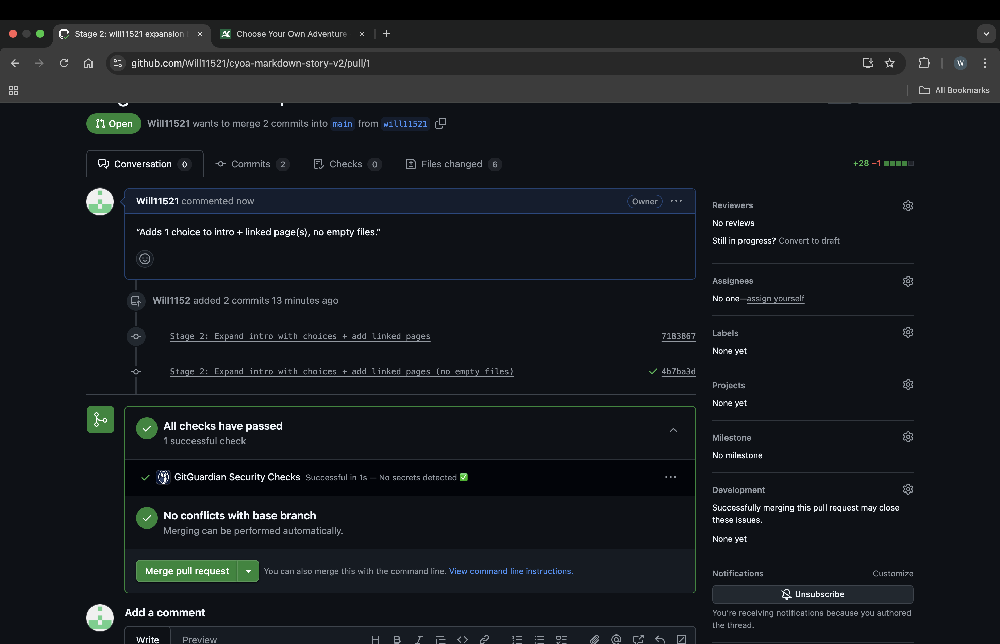

# Workflow Log — The Terminal at Midnight

This file documents how I worked through the assignment stages.  
Since I was working solo, I simulated a 3-person team by creating multiple branches with different names.  
Each stage shows the commits, branches, and pull requests I made, along with screenshots for proof.

---

## Stage 1: Setup

- Created a new repository.  
- Added only **intro.md** with the opening story text.  
- Committed and pushed to `main`.

---

## Stage 2: Expand

- Made separate branches: `will11521`, `member2-demo`, `member3-demo`.  
- On each branch, added a new choice to `intro.md` and created a new Markdown page for it.  
- Linked all choices so nothing was empty.  
- Opened pull requests for each branch.

---

## Stage 3: Review

- Reviewed and merged all pull requests into `main`.  
- Resolved a small conflict in `intro.md` where choices overlapped.  
- Deleted merged branches afterwards to keep the repo clean.  
- Pulled the final changes locally to stay up to date.

---

## Stage 4: Edit

- Each “member” created a new edit branch:  
  - `will11521-edit` → added a detail to the train page.  
  - `member2-edit-v2` → added a new option to pry open the gates.  
  - `member3-edit` → added sensory detail to the information desk.  
- Also fixed missing links from the desk by adding two new pages:  
  `pages/choice-c2-exit.md` and `pages/choice-c2-back.md`.  
- Each branch was committed, pushed, and a pull request created.

---

## Stage 5: Final Review

- Merged all Stage 4 pull requests into `main`.  
- Deleted the feature branches.  
- Confirmed locally with `git pull` that everything is up to date.  
- Final check: no empty files, all links work, repo looks clean.

---

## ✅ Conclusion

I followed all five stages step by step:
- Setup → Expand → Review → Edit → Finalize.  
- Every choice leads to a valid file.  
- Workflow is documented with commits, branches, and pull requests.

This completes the assignment requirements.